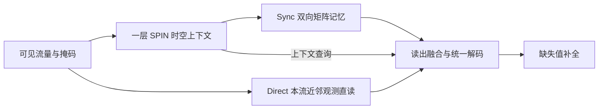

# 当前方法与最小实验范围

2026-09-16，按用户“再check一下当前的方法是啥？注意实验协议不要超出ccf c级别的复杂程度”的要求核对并收束。

## 方法

一层SPIN根据整窗可见值、掩码和相关邻流生成时空上下文；上下文生成Sync的键、值和查询，仅可见源写入双向同步矩阵记忆。Direct并行读取本流前后各两个最近的真实观测。两路读出逐方向相加，再与上下文查询一起送入统一解码器。全部参数从头共同训练，使用缺失位置L1损失；目标是离线补全。

Direct与Sync每个方向各输出128维，按 `h_forward = Direct_forward + Sync_forward`、`h_backward = Direct_backward + Sync_backward` 等系数相加，再与128维上下文查询拼成384维解码输入。没有显式比例门控；系数1:1不等于预测贡献各50%，因为特征尺度和解码权重共同影响输出。

按各通路独有参数计，Direct的两个位置投影与读出投影共1,440参数，Sync新增K/V共24,960参数；Q、位置编码、上下文编码与解码器属于共享部分。该划分不等于特征贡献占比。

SPIN编码宽度32；Sync为4头、每头32维；总参数为Abilene98,693、GEANT108,869。当前复用一层真实SPIN编码块，与原四层SPIN参考模型有区别。

唯一核心消融为独立训练的 `spin_direct_no_memory`：保留SPIN、Direct、上下文查询和解码器，删除Sync的K/V及矩阵扫描。两个模型共有参数使用相同初值，但参数量不同。这足以判断新增记忆分支的价值，不单独证明同步更新规则优于所有其他聚合规则。

实现以 `experiments/spin_sync_unified_v1/models.py` 为准；核对SHA256为a9a27086cfec26999cc5749acbab79264504103617c457d61db1a39566b90fcb。详细公式仅作内部实现资料，见METHOD_CN.md。

## 最小实验范围

| 项目 | 固定范围 |
|---|---|
| 数据 | Abilene、GEANT |
| 输入 | 50槽窗口，20%观测率 |
| 缺失条件 | 均匀、不均匀、带共享缺口，共三种 |
| 候选与消融 | Full、去掉Sync的no_memory |
| 重复 | 两个初始化种子41001/41002，两WAN共8条训练轨迹 |
| 训练 | 同一配对训练设置，总120轮；按开发NMAE选择检查点 |
| 指标 | NMAE为主、NRMSE辅助，完整保留三条件和两个种子 |
| 成本 | 同一H20上的完整推理延迟和显存，加参数总量 |
| 正文呈现 | 一张精度表（含去记忆消融）＋一张成本表 |

沿用已有基线结果作为参考。本轮不扩展观测率、模型层数、门控、损失组合或超参数搜索；不新增等容量、串行记忆等消融矩阵。旧早停阶段与fixed120接续属于同一训练轨迹，不重复计数。

测速中的暖身、重复计时及B1/B8是一个成本测量流程的设置，不是新的模型实验。检查点恢复、文件哈希和数值正确性检查是内部工程记录，不包装成论文贡献或增加正文实验表。训练曲线留在研究附录，需要解释收敛时再引用。

当前结果是开发集证据；已有历史后续区间不能重新宣称为未见测试。简化实验规模不改变这一解释边界。既定8条轨迹和成本测量均已完成，完整结果见[精度与成本表](FINAL_RESULTS_CN.md)。独立研究评审已完成，建议优先推进SPIN＋Direct并保留Full的误差／成本取舍；四页中文内部初稿已完成，见[研究结项](OUTCOME_CN.md)。
