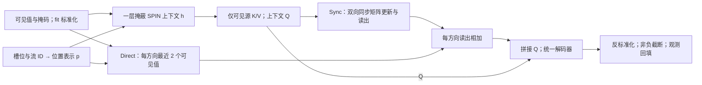

# SPIN 上下文驱动的 Direct＋Sync 统一模型：实现方法记录

2026-09-16。本文档仅说明当前 `spin_sync_direct` 与 `spin_direct_no_memory` 的已实现结构，不记录实验结果或性能结论，暂不纳入论文。

核心流程是：一层 SPIN 时空块生成上下文；上下文产生同步矩阵记忆的键、值和查询；Direct 分支直接读取本流邻近可见数值；两个方向的读出经同一个解码器产生补全值。**所有可训练参数从头联合训练**，没有加载已训练 SPIN 的权重，也没有在 SPIN 最终预测上加一个冻结主干修正头。

## 1. 输入、统计量与记号

省略批次下标时，完整窗口为 $X\in\mathbb R_{\geq0}^{T\times F}$，观测掩码为 $M\in\{0,1\}^{T\times F}$，其中 $M_{ti}=1$ 表示位置可见。当前实现固定 $T=50$，时间槽为 $t=0,\ldots,49$，所有流同时进入上下文编码。图节点对应 OD 流。

模型使用完整拟合段估计的**全局**均值 $\mu$ 和总体标准差 $\sigma$，尺度下限为 $10^{-8}$。它们通过已有 `SPINAdapter.configure_fit_statistics` 从登记的拟合统计量合成，存为 FP32 缓冲区；没有重新使用开发数据估计统计量。设 $C=\operatorname{mean}(|X_{\mathrm{fit}}|)$，由于流量非负，全局均值在数学上等于 $C$。实际尺度合成沿用已有实现及其中逐流均值的 FP32 精度。

标准化输入为

$$
z_{ti}=\begin{cases}
(X_{ti}-\mu)/\sigma,&M_{ti}=1,\\
0,&M_{ti}=0.
\end{cases}
$$

实现先用 `where` 清理隐藏位置，再做标准化；隐藏真值不进入计算图。完整真值只用于拟合监督和评价。

对目标流 $i$，记 $\mathcal N_i$ 为自身与最多八个拟合段正 Pearson 相关邻流组成的集合，实际表用无效槽补齐。空间注意力使用 $\mathcal N_i\setminus\{i\}$；Sync 写入则保留自身。标准化和邻域均在推理期间固定。

## 2. 一层 SPIN 时空上下文

### 2.1 位置与初始表示

位置编码 $p_{ti}\in\mathbb R^{32}$ 由归一化槽位 $u_t=t/49$、可学习流嵌入 $e_i$、MLP 和固定正弦位置编码组成：

$$
p_{ti}=\operatorname{PE}_t+\operatorname{MLP}_{p}
\left(\operatorname{LeakyReLU}(W_u u_t+b_u+e_i)\right).
$$

令 $E_x$ 为两层、宽度 32 的 ReLU 数值编码器，$A_x$ 为 $1\to32$ 的仿射跳连。进入时空块的表示为

$$
h^{(0)}_{ti}=\operatorname{LayerNorm}\left(p_{ti}+M_{ti}E_x(z_{ti})\right)
+M_{ti}A_x(z_{ti}).
$$

因此缺失位置保留位置表示，但不加入隐藏数值；可见位置拥有数值编码和直接跳连。

### 2.2 观测源上的加性注意力

当前使用已有 SPIN 实现的 `TemporalGraphAdditiveAttention` 一次，宽度为 32，包含本流时间注意力、邻流时空注意力、根节点跳连和归一化。

对某一注意力分支，源位置 $(s,j)$ 与目标 $(t,i)$ 先构造消息

$$
m_{ti\leftarrow sj}=\psi\left(A_s h^{(0)}_{sj}+A_t h^{(0)}_{ti}\right),
\qquad e_{ti\leftarrow sj}=w^\top m_{ti\leftarrow sj},
$$

其中 $A_s,A_t$ 表示相应线性／仿射投影，$\psi$ 为现有 PReLU 消息网络。时间分支和空间分支使用各自参数。

- 本流时间分支的源集合为 $\{s:M_{si}=1,\ s\ne t\}$。它屏蔽当前时间对角项，但允许查询之前和之后的可见源。
- 空间分支对每个 $j\in\mathcal N_i\setminus\{i\}$ 使用 $\{s:M_{sj}=1\}$。**每条邻流边分别在源时间维归一化，再将各边消息求和**，不是将全部邻流与时间位置合并成一次 softmax。

对上述每个源集合 $\mathcal A$，实现的归一化形式为

$$
\alpha_{ti\leftarrow sj}
=\frac{\exp(e_{ti\leftarrow sj}-e_{\max})}
{\sum_{r\in\mathcal A}\exp(e_{ti\leftarrow rj}-e_{\max})+5\times10^{-8}},
\qquad s\in\mathcal A,
$$

不允许的源权重为零，空集合读出为零。这里保留了当前实现分母中的数值常数。

记时间与空间读出为 $a^{\mathrm{temp}}_{ti}$ 和 $a^{\mathrm{spatial}}_{ti}$，则

$$
h_{ti}=\operatorname{Norm}_{\mathrm{TSL}}
\left(a^{\mathrm{temp}}_{ti}+a^{\mathrm{spatial}}_{ti}+A_{\mathrm{root}}h^{(0)}_{ti}\right)
\in\mathbb R^{32}.
$$

此处 `TSLNorm` 沿最后的特征维使用 $(x-\operatorname{mean}x)/(\operatorname{std}x+10^{-5})$，再做可学习缩放与平移；它与前面的标准 `LayerNorm` 分开实现。

**上下文 $h_{ti}$ 可以依赖整个窗口的可见值。** 后续矩阵按正向或反向扫描，不会消除这种双向依赖。

## 3. 仅可见位置产生有效 K/V 写入

Sync 有 $H=4$ 个头，每头维度 $d=32$，拼接宽度 $Hd=128$。上下文通过共享投影生成

$$
k^{(a)}_{tj}=\operatorname{norm}_{2,\epsilon}
\left([A_K h_{tj}]_a\right),\qquad
v^{(a)}_{tj}=\left[A_{V2}\operatorname{GELU}(A_{V1}h_{tj})\right]_a,
$$

$$
q^{(a)}_{ti}=\operatorname{norm}_{2,\epsilon}
\left([A_Qh_{ti}]_a\right),\qquad a=1,\ldots,4,
$$

其中 $[\cdot]_a$ 取对应的 32 维头，$\operatorname{norm}_{2,\epsilon}(x)=x/\max(\lVert x\rVert_2,10^{-6})$。K 与 Q 在各自头内归一化，V 不归一化。

对目标 $i$、槽位 $t$，将邻域源排列为 $J_i\leq9$ 个槽，构造每头的矩阵

$$
K^{(a)}_{it},V^{(a)}_{it}\in\mathbb R^{J_i\times32}.
$$

只有有效邻流且 $M_{tj}=1$ 的行保留对应 $k^{(a)}_{tj},v^{(a)}_{tj}$；隐藏位置与填充槽的 **K 和 V 均在投影后清零**。因此隐藏位置即使有上下文表示，也不成为记忆写入事件。写入的 V 是可见源的上下文表示，不是将某个补全预测当作新的真实测量。

## 4. 每头同步矩阵更新与双向读出

### 4.1 分母与同步更新

每个目标流、每个头拥有独立的 $32\times32$ 状态 $S$。对固定 $(i,t,a)$，记 $K=K^{(a)}_{it}$、$V=V^{(a)}_{it}$。更新分母为

$$
G=KK^\top,\qquad
c^{(a)}_{it}=\max\left(1,\max_r\sum_{s=1}^{J_i}|G_{rs}|\right).
$$

该量是当前槽位、当前头的 Gram 矩阵最大绝对行和，下限为一；它不是可见邻流数量，也不是跨头共用的标量。无效槽已置零，不贡献 Gram 项。

令 $S_{\mathrm{old}}$ 为处理该槽位之前的状态，则所有同刻源相对于**同一个旧状态**计算残差，并一次更新：

$$
E=V^\top-S_{\mathrm{old}}K^\top\in\mathbb R^{32\times J_i},
$$

$$
\boxed{\quad S_{\mathrm{new}}=S_{\mathrm{old}}+\frac{EK}{c^{(a)}_{it}}\quad}.
$$

这是代码复用的 `SyncDeltaModel._memory_scan` 同步分支。它没有在同一槽位内依次写入不同邻流；每个源的残差都使用上述 $S_{\mathrm{old}}$。当该槽位没有任何可见源时，$K=V=0$、$c=1$，状态不变。

### 4.2 扫描顺序与读出时机

正向按 $0\to49$ 扫描，初态 $S^{\to,a}_{i,-1}=0$；反向按 $49\to0$ 扫描，初态 $S^{\leftarrow,a}_{i,50}=0$。两个方向共享 K/V/Q 参数，但使用独立状态。

用 $\mathcal U(S,K,V)$ 表示上面的同步更新，递推为

$$
S^{\to,a}_{it}=\mathcal U(S^{\to,a}_{i,t-1},K^{(a)}_{it},V^{(a)}_{it}),
\qquad
S^{\leftarrow,a}_{it}=\mathcal U(S^{\leftarrow,a}_{i,t+1},K^{(a)}_{it},V^{(a)}_{it}).
$$

查询在**整个当前槽位的写入完成后**读取状态：

$$
r^{\to}_{ti}=\operatorname{concat}_{a=1}^{4}\left(S^{\to,a}_{it}q^{(a)}_{ti}\right),
\qquad
r^{\leftarrow}_{ti}=\operatorname{concat}_{a=1}^{4}\left(S^{\leftarrow,a}_{it}q^{(a)}_{ti}\right)
\in\mathbb R^{128}.
$$

状态在每个新窗口重新置零，不跨窗口持久保存。正向的写入顺序虽然截至当前槽位，但被写入的上下文已经使用整窗可见数据，故 $r^{\to}$ 不是只由过去观测构成的因果表示。当前任务始终是离线双向插补。

## 5. Direct：每方向最近两个可见数值

Direct 使用**位置编码 $p$** 计算权重，使用标准化的可见值 $z$ 做数值读出。它不使用上下文 $h$ 或 SPIN 最终预测作为打分输入。

对目标流 $i$、查询 $t$，分别定义

$$
\mathcal S^{\to}_{ti}=\operatorname{Nearest2}\{s\leq t:M_{si}=1\},
\qquad
\mathcal S^{\leftarrow}_{ti}=\operatorname{Nearest2}\{s\geq t:M_{si}=1\},
$$

即按 $|t-s|$ 取该方向最近的至多两个可见位置。若查询本身可见，$s=t$ 可同时进入两个方向；最终该位置仍回填观测原值。

两个方向共享两个带偏置的 16 维仿射 Q/K 投影 $\phi_Q^D,\phi_K^D$，打分如下：

$$
\ell_{tis}=\frac{\phi_Q^D(p_{ti})^\top\phi_K^D(p_{si})}{\sqrt{16}}
-\log(1+|t-s|).
$$

只在各方向选出的集合内做 softmax：

$$
\beta^{\diamond}_{tis}=
\frac{\exp(\ell_{tis})}{\sum_{u\in\mathcal S^{\diamond}_{ti}}\exp(\ell_{tiu})},
\quad s\in\mathcal S^{\diamond}_{ti},\quad \diamond\in\{\to,\leftarrow\}.
$$

其余位置为零；集合为空时 `safe_masked_softmax` 返回全零权重。形成三个特征：

$$
f^{D,\diamond}_{ti}=
\left[
\sum_s\beta^{\diamond}_{tis}z_{si},\quad
\sum_s\beta^{\diamond}_{tis}\frac{|t-s|}{49},\quad
\mathbf1\{\mathcal S^{\diamond}_{ti}\ne\varnothing\}
\right]^\top\in\mathbb R^3,
$$

$$
d^{\diamond}_{ti}=W_D f^{D,\diamond}_{ti}\in\mathbb R^{128},
\qquad W_D\in\mathbb R^{128\times3}.
$$

`direct_fusion` 不含偏置，因此无可见支持时 $f^D=0$ 且 $d=0$。本流整窗无观测时仅将 Direct 读出置零，邻流 Sync 与上下文 Q 仍可参与预测。距离始终按发布序列的槽位计算；尤其 GEANT 处理后 CSV 与原生时间戳的对应尚未建立，不能把这些距离直接换算为物理分钟。

## 6. 统一解码、输出与损失

先在每个方向直接相加两条路径：

$$
g^{\to}_{ti}=r^{\to}_{ti}+d^{\to}_{ti},\qquad
g^{\leftarrow}_{ti}=r^{\leftarrow}_{ti}+d^{\leftarrow}_{ti}.
$$

拼接双向读出及归一化查询

$$
u_{ti}=\left[g^{\to}_{ti};g^{\leftarrow}_{ti};
\operatorname{concat}_{a=1}^4 q^{(a)}_{ti}\right]\in\mathbb R^{384},
$$

由共享 $384\to128\to1$ 解码器产生标准化预测：

$$
\widehat z_{ti}=W_2\operatorname{GELU}(W_1u_{ti}+b_1)+b_2,
\qquad R_{ti}=\mu+\sigma\widehat z_{ti}.
$$

末层 $W_2,b_2$ 均初始化为零，所以初始未裁剪输出等于全局拟合均值 $\mu$。模型没有现成的 SPIN 父预测作为输出起点。正式输出为

$$
\widehat X_{ti}=\begin{cases}
X_{ti},&M_{ti}=1,\\
\max(0,R_{ti}),&M_{ti}=0.
\end{cases}
$$

对批次缺失集合 $\Omega=\{(b,t,i):M_{bti}=0\}$，训练优化未裁剪原始量纲预测的缺失 L1：

$$
\boxed{\quad
\mathcal L=\frac{1}{C|\Omega|}
\sum_{(b,t,i)\in\Omega}|R_{bti}-X_{bti}|,
\qquad C=\operatorname{mean}(|X_{\mathrm{fit}}|)>0
\quad}.
$$

这里只有统一解码器的最终输出监督，非负截断与观测回填属于输出／评价步骤。时空块、K/V/Q、Direct 与解码器通过同一目标端到端更新。当前训练器采用 AdamW，学习率 $10^{-3}$、权重衰减 $10^{-4}$、批量八、梯度范数阈值一；本说明不据此推断收敛或最终效果。

## 7. `no_memory` 的实际变化

`spin_direct_no_memory` 保留同样的一层 SPIN 上下文、Direct、上下文查询 Q 和 $384\to128\to1$ 解码器。它删除 K/V 模块，不执行矩阵扫描，令 $r^{\to}=r^{\leftarrow}=0$，然后独立从头训练。

构造器先按相同顺序实例化模块，再为 `no_memory` 删除 K/V，使同种子下保留参数的初始值逐张量一致。两个变体参数量不同，不能称为等参数量对照；它们用于比较当前统一结构中增加 Sync 路径的作用，而不是排除参数量或所有其他记忆方案的影响。

## 8. 结构图

图中所有可学习模块共同训练；Sync 的两个状态在每个窗口内重新建立。Direct 的权重依赖位置表示和可见支持集合，读出的数值来自本流真实观测。

## 9. 与原 SPIN 流程的边界及代码依据

SPIN 引用沿用现有草稿中已核验条目：Ivan Marisca, Andrea Cini, Cesare Alippi, *Learning to Reconstruct Missing Data from Spatiotemporal Graphs with Sparse Observations*, NeurIPS 35, pp. 32069–32082, 2022。[原始论文](https://proceedings.neurips.cc/paper_files/paper/2022/file/cf70320e93c08b39b1b29a348097a376-Paper-Conference.pdf)，BibTeX 键 `marisca2022spin`。

当前统一模型复用其位置、数值编码及一个观测掩蔽时空块，但**不等同于项目中的原四层 SPIN 比较模型**：没有四次层级读出，也没有原第四层的可见／缺失嵌入切换与空间源掩码解除；训练不使用原四读出深监督、Adam 与重启余弦日程。与旧四层 SPIN 的数值比较不能单独归因为同步记忆机制。当前 Sync 方程来自已有本地 `_memory_scan`，本文档没有为其另行虚构文献出处。

实现入口（均相对于 CalibTM 仓库）：

| 内容 | 对应源码 |
|---|---|
| 一层上下文、K/V/Q、Direct、统一解码 | `experiments/spin_sync_unified_v1/models.py` |
| 同步扫描与 Gram 分母 | `experiments/sync_delta_v1/models.py`：`_memory_scan`、`gram_denominator` |
| 加性时空消息、逐边时间归一化 | `experiments/spin_comparison_v1/attention.py` |
| 位置编码与归一化细节 | `experiments/spin_comparison_v1/positional.py`、`primitives.py` |
| 全局 fit 统计量 | `experiments/spin_comparison_v1/models.py`：`configure_fit_statistics` |
| 缺失 L1 与训练配置 | `experiments/sync_delta_v1/engine.py`、`experiments/spin_sync_unified_v1/runner.py` |

撰写时统一模型源码 SHA256 为 `a9a27086cfec26999cc5749acbab79264504103617c457d61db1a39566b90fcb`，原同步读出源码 SHA256 为 `575329e6f4bf7b5e5eb01ec153bf69bef6a577b41890147aa457d6eeb6aa0508`。本文件只经源码核对，未执行模型或 GPU；是否进入论文由完成后的实证结果另行决定。
